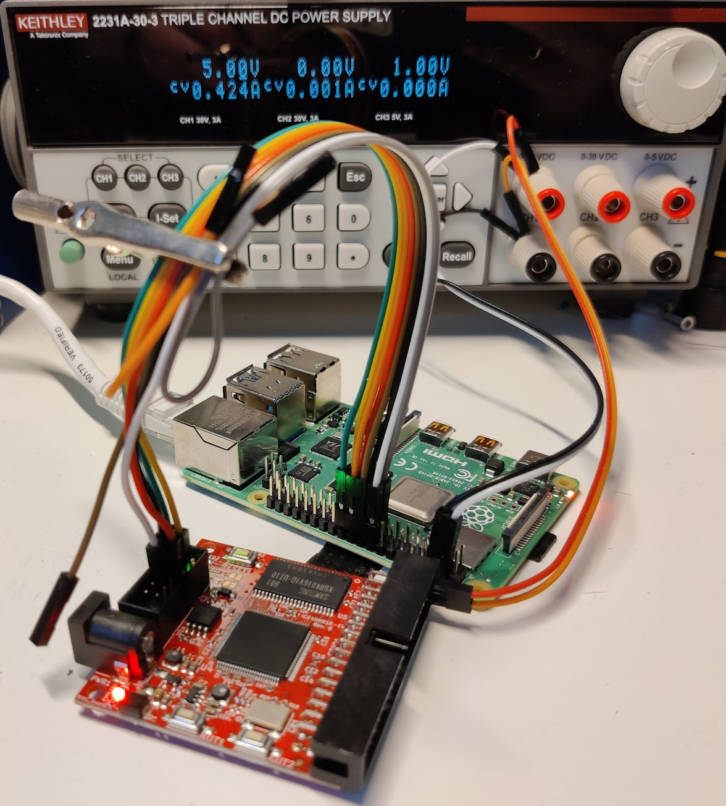

# iCE40HX1K-EVB-exploration

Getting started with the [Olimex iCE40HX1K-EVB](https://www.olimex.com/Products/FPGA/iCE40/iCE40HX1K-EVB/) using an open-source toolchain, VHDL and a Raspberry Pi 4 as programmer.

**New here? Start with [QUICKSTART.md](QUICKSTART.md).**

## Toolchain

All synthesis tools come from the [OSS CAD Suite](https://github.com/YosysHQ/oss-cad-suite-build) — a single pre-built bundle, no manual compilation needed.

| Tool | Purpose |
|------|---------|
| `ghdl` | VHDL analysis and simulation |
| `yosys` + GHDL plugin | VHDL synthesis |
| `nextpnr-ice40` | Place and route |
| `icepack` | Pack bitstream |

Install: download the latest `oss-cad-suite-linux-x64-*.tgz` from the releases page and add the `bin/` directory to your `PATH`.

## Build flow

```
ghdl → yosys (ghdl plugin) → nextpnr-ice40 → icepack → top.bin
```

## Programming via Raspberry Pi

The board has no USB programmer — flashing is done over SPI from a Raspberry Pi (or similar SBC). Synthesis runs on your main machine; the `make flash` target copies the bitstream to the Pi over SSH and runs flashrom remotely. You never need to manually SSH into the Pi or run anything there yourself.

The Pi is reachable as `raspberrypi.local` (or by IP from your router's device list). Set up SSH keys once to avoid password prompts:

```bash
ssh-copy-id pi@raspberrypi.local
```

See [QUICKSTART.md](QUICKSTART.md) for the full setup walkthrough.

**RPi one-time setup:**
```bash
echo dtparam=spi=on >> /boot/config.txt  # then reboot
# build flashrom from source (see https://github.com/anse1/olimex-ice40-notes)
echo 24 > /sys/class/gpio/export
echo out > /sys/class/gpio/gpio24/direction
```

**Flash a bitstream:**
```bash
# on your machine
scp top.bin pi@raspberrypi.local:~/

# on the RPi
tr '\0' '\377' < /dev/zero | dd bs=2M count=1 of=image.bin  # pad to flash size
dd if=top.bin conv=notrunc of=image.bin
flashrom -p linux_spi:dev=/dev/spidev0.0,spispeed=20000 -w image.bin
echo in > /sys/class/gpio/gpio24/direction  # release reset
```

The padding step is required because `flashrom` writes the full 2 MB flash chip; the bitstream alone is much smaller.

**RPi → EVB wiring (RPi pin → EVB header):**

Only 5 signals are needed:



| RPi pin | Signal | EVB |
|---------|--------|-----|
| 18 (GPIO24) | CRESET | CRESET |
| 19 (MOSI) | SDO | SDO |
| 21 (MISO) | SDI | SDI |
| 23 (CLK) | SCK | SCK |
| 24 (CE0) | CS | #CD/SS_B |

> **Pin-out warning:** The UEXT/SPI header on the EVB can appear to be oriented either way depending on how you approach the board, and pin 1 is **not marked on the PCB**. Pin 1 is the **right pin of the bottom row, directly above the barrel jack**. Two nights were lost to a connector plugged in 180 degrees rotated. When in doubt, probe 3v3 and GND before connecting the SPI lines.

## Examples

### [`examples/blink`](examples/blink)

Ported from the [official Olimex demo](https://github.com/OLIMEX/iCE40HX1K-EVB/tree/master/demo/ice40hx1k-evb) (originally Verilog + arachne-pnr) to VHDL with nextpnr-ice40.

Two modes toggled by pressing both buttons simultaneously:
- **Mode 0** — LEDs mirror buttons directly
- **Mode 1** — LEDs blink in opposition at ~1 Hz (0.5 s each phase)

```bash
cd examples/blink
make                        # synthesise → blink.bin
make flash RPI_HOST=pi@...  # copy to RPi and flash
```

## References

- [Getting started tutorial (cocoacrumbs)](https://www.cocoacrumbs.com/blog/2023-01-27-getting-started-with-the-olimex-ice40hx1k-evb/)
- [RPi programming notes (anse1)](https://github.com/anse1/olimex-ice40-notes)
- [SBC programmer interface inspiration (tomek-szczesny)](https://github.com/tomek-szczesny/ice40hx8k-evb-prog-if)

---

made with <3 by [nacho.works](https://nacho.works)
